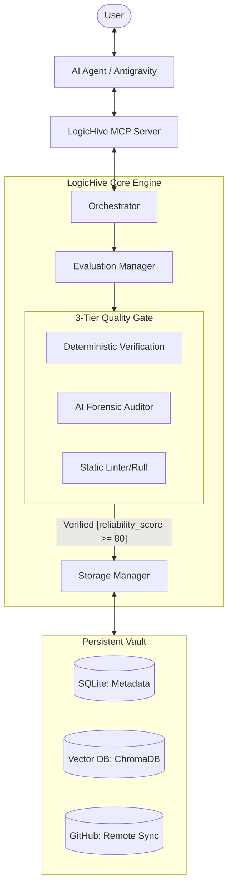

# 🏗️ LogicHive System Architecture

LogicHive is a **Logic Orchestration Layer** designed to bridge the gap between volatile AI-generated code and persistent, verified software assets.

---

## 1. Problem Definition (問題定義)

In an AI-augmented development workflow, we face three critical challenges:
- **Logic Rot**: High-quality logic generated by AI is often lost in fragmented chat histories or discarded after a single use.
- **Sophistry vs. Logic**: AI is an expert at creating code that *looks* correct (Sophistry) but lacks structural rigor or factual proof.
- **The Validation Bottleneck**: Verifying AI-generated code manually is slow, while relying on AI self-evaluation often leads to "blind leading the blind."

LogicHive exists to transform "disposable code" into "**Reusable Logic Atoms**" through a rigorous, multi-tiered verification pipeline.

---

## 2. Design Decisions (設計の判断)

### Why a "Hybrid" Quality Gate?
We chose a weighted scoring system (4:3:2:1) because AI-only evaluation is subjective.
- **Deterministic Veto (AST)**: We use Python's `ast` module to count assertions and detect "hollow logic" before the AI even sees the code. If the "Fact" layer fails, the asset is rejected instantly.
- **Isolated Runtimes**: We use ephemeral virtual environments (Environment Pooling) to verify execution without polluting the host system.

### Thin Client + Dynamic Engine (ADR-0018)
LogicHive is distributed using a hybrid approach to maximize portability while evading "dependency hell":
- **Thin Settings Client**: A lightweight, standalone `.exe` built with Flet for zero-friction user control (Task Scheduler, Uninstallation, Config).
- **Dynamic Venv Engine**: The core Hub and MCP Server are executed within a dynamic virtual environment (`~/.logichive/.venv`), built on the fly using `uv`. This frees the system to utilize heavy, native dependencies like ChromaDB without bloating the initial download or causing PyInstaller crashes.

### Why MCP (Model Context Protocol)?
To make LogicHive a "first-class citizen" in the agentic ecosystem. By using MCP, any AI agent (Antigravity, Cursor, etc.) can discover and store logic without custom integration code.

---

## 3. High-Level Diagram (全体図)

---

## 4. Constraints & Limitations (制約と限界)

To maintain reliability, LogicHive operates under the following constraints:
- **Language Lock-in**: Currently optimized for **Python**. While other languages can be stored, the "Deterministic Veto" (AST analysis) is most rigorous for Python logic.
- **Static Analysis Limits**: AST analysis can detect the *presence* of tests, but not necessarily the *quality* of the test logic itself (though AI forensic auditing helps mitigate this).
- **Environment Overhead**: While pooling mitigates delays, registering logic that requires massive dependencies (e.g., specific CUDA versions) still incurs a non-zero cold-start cost.
- **Not a Production Runner**: LogicHive is a *Vault* and *Verifier*, not a high-throughput production execution engine. It is designed for development-time assetization.

---

*Last Updated: 2026-05-11*
