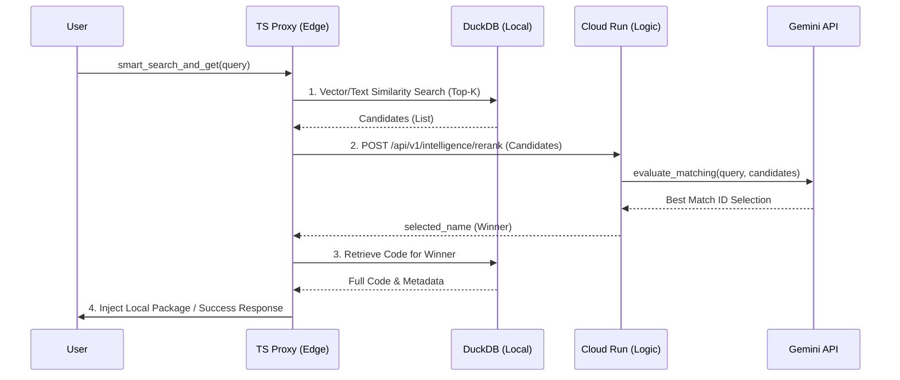

# LogicHive システム詳細設計書 (Hybrid Edge-Cloud Edition)

**作成者**: Antigravity (AI Persona)
**最終更新日**: 2026-02-24
**バージョン**: 3.0.0 (Phase 31: Hybrid Edge-Cloud Architecture)

---
## 0. Product Vision

### 0.1 ビジョン

**LogicHive** は、**AIエージェントが生成したコードを「書き捨てない」ためのインフラ**である。
Cursor、Antigravity、Claude Desktop などのMCPクライアントを持っていれば、プログラミング資産をシームレスに蓄積・再利用でき、毎回同じコードを生成し直すリソースの無駄を防ぐことができる。

本バージョン(v3)では、開発者の「クラウドインフラ（GCP）のコスト最小化」と「コアロジック（IP）の機密性確保」を同時に達成するため、**ハイブリッド・エッジ・クラウド（Hybrid Edge-Cloud）アーキテクチャ**へと進化した。
計算資源とストレージを使用者（Edge）にオフロードしつつ、知能（Intelligence）のみをサーバーレス（Cloud）に集約する分散型デザインを採用している。

### 0.2 ターゲットペルソナ

| ペルソナ | 技術レベル | 利用シナリオ |
|---|---|---|
| **自社/個人サービス運営者** | クラウド/Edge設計ができる | クライアントモジュールをOSSとして配布しつつ、自作の高品質なプロンプトやコアとなる評価ロジック（GCP側）は盗まれないように分離運用する。 |
| **AIエージェント (Machine User)** | N/A | MCPプロトコル経由でローカルのEdge DBとリモートのCloud Logicを跨いで自律実行 |
| **コスト意識の高い開発者** | GCP課金を嫌う | マネージドDB（Supabase等）を使わず、DB維持費「ゼロ円」でSaaSレベルの体験を得る。 |

### 0.3 The Hybrid Shift (Thin-Cloud 原則)

SaaSとしての体験を提供しつつ、運営コストを最小化するためのパラダイムシフト。

*   重いDBのEdge移譲 → **状態（データベース）はTS-Proxy（ローカルのDuckDB）に持たせ、ユーザーのPCリソースを最大限活用する。GCPのストレージ代は完全無料。**
*   推論のCloud秘匿化 → **AI処理・品質評価・コード解析ロジックはGCP Cloud Run上のAPIに隠蔽。GitHubでProxyを公開しても、一番の「推論の肝」は決して流出しない。**
*   Cloud Runの完全ステートレス化 → **バックエンドは状態を持たないため、インスタンスが消滅してもデータが消えることはなく、安全にスケール・運用（必要ならmax-instances=1で動作確認も可能）ができる。**

### 0.4 設計方針（優先度）

| 優先度 | 機能 | 備考 |
|---|---|---|
| 1位 | IP（知的財産）の保護 | 知能ロジックをGCPエンドポイントの裏側に配置し、解析手法を秘匿する。 |
| 2位 | インフラコストの極小化 | 状態管理をEdge（ユーザー側PC）のDuckDBに任せ、クラウドDB費用を0にする。 |
| 3位 | クラウド・ネイティブとの融合 | 分散アーキテクチャ（Edge Storage + Cloud Intelligence）によるスケーラビリティの実証。 |

### 0.5 デザインフィロソフィ
*   **Edge Compute Utilization**: クラウド時代に逆行し、あえて余っているユーザーのローカルPCリソース（ストレージ/CPU）を搾取（活用）し、サービス運営者のコストを下げる。
*   **Logic Obfuscation**: コード生成や選別ロジック（`router.py`, `quality_gate.py`）をクラウドに置くことで、利用者に「知見（ノウハウ）」を物理的に渡すことなく機能だけを提供する。
*   **Draft First**: 高品質な関数の完成を待つよりも、下書き（Logic Draft）がそこにあることを優先する。品質はクラウド側の知能が評価・選別する。

---

## 2. アーキテクチャ

システムはローカルエッジで状態を持つ **TS Proxy (Edge DB)** と、知能と評価を提供する **FastAPI Cloud Hub (Intelligence API)** の協調アーキテクチャ（ハイブリッド型）を採用している。

### 2.1 技術スタック
*   **Edge Client**: TypeScript (Node.js 18+)
*   **Edge Database**: DuckDB (ローカル内包型リレーショナル/ベクトルハイブリッドDB)
*   **Cloud API**: Python 3.12-slim FastAPI (GCP Cloud Run Serverless)
*   **Intelligence**: Gemini (Google Cloud) による推論・評価・Reranking
*   **Quality Gate**: Ruff (Linter)
*   **Package Manager**: uv

### 2.2 全体構成図

```mermaid
graph TD
    User[AI Agent / User] <-->|MCP Protocol (Stdio)| Proxies[TS MCP Proxy (Local Edge)]
    
    subgraph "User Local Environment (Edge)"
        Proxies <-->|SQL/Vector Search| LocalDB[(Local DuckDB)]
        Proxies -.->|File IO| ProjectDir[Project Directory]
    end
    
    subgraph "GCP Cloud Run (Intelligence Hub / Secret Logic)"
        Proxies <-->|HTTPS REST API / Verify & Rerank| Master[FastAPI Background Server]
        
        subgraph "Stateless Logic Engine (Python 3.12)"
            Master --> Router[router.py (LLM Evaluation)]
            Master --> QGate[quality_gate.py (Ruff/Security Check)]
            Master --> Dependency[dependency_solver.py]
        end
    end

    subgraph "External AI Services"
        Router -.-> |HTTPS| Gemini[Google Gemini API]
    end
```

### 2.3 ディレクトリ構造 (Hybrid Edition)
*   `ts-proxy/`: エディタに登録するEdge Client。npmの `duckdb` を積載し、DBアクセスとGCPとの通信調整（Orchestration）を行う。
*   `backend/mcp_core/infra/`: Cloud Run用エンドポイント（`background_server.py`）。ステートレス化。
*   `backend/mcp_core/engine/`: 秘匿すべきエンジン層。AIルーティング（`router.py`）、AST解析や品質チェック（`quality_gate.py`）。
*   `dev_tools/`: Cloud RunなどへのSaaS運用基盤（`deploy.py`）。

---

## 3. コンポーネント詳細

### 3.1 統合エントリポイント
*   **`ts-proxy/src/index.ts`**: MCPの入り口。`--hub-url` の引数を取り、リモートのサーバーに対する完全なプロキシとして振る舞う。

### 3.2 AI Integration Layer (`backend/mcp_core/engine/`)
重武装だったローカルMLレイヤーは、外部APIを叩く単なる「クライアント」へと軽量化された。
*   **`embedding.py`**: `GeminiEmbeddingService` または `OllamaEmbeddingService` のいずれかにルーティングする。
*   **`router.py`**: 自然言語による曖昧な要求に対し、最も適切な関数の「選別(Reranking)」を Gemini または Ollama に行わせる知的判断機能。

### 3.3 Core Operations (`backend/mcp_core/engine/logic.py`)
ビジネスロジックの中核。
*   従来のスレッドキュー型 Background Task Worker は残しつつ、非同期処理によるDB（DuckDB）のロック回避を担保。

### 3.4 Developer Tools (`dev_tools/`)
SaaS運用とCI/CDに特化したツール群。
*   **`dev.py`**: 統合開発ランチャー。`uv run` をラップし、Lint/Format/Test を一括実行。
*   **`deploy.py`**: 指定した GCP プロジェクトに対し、API有効化・コンテナビルド・Cloud Run デプロイまでをワンストップで実行するスクリプト。BYOK用の引数 (`--gemini-key`) をサポート。

---

## 4. データモデル (DuckDB Schema)

従来バージョンから変更なし。ただし、埋め込み(Embeddings)の次元数は使用するモデル（Gemini=1536, Ollama=1024等）に依存して動的に格納される。

---

## 5. 主要プロセスのシーケンス

### 5.1 関数検索プロセス (Hybrid Search Flow)



---

## 6. 今後の拡張性・改善点

1.  **スケーラビリティとステートレスの担保**:
    *   SaaS構築においてCloud Run等のサーバーレス環境を使う際、状態（DB）をコンテナ内部に持つことはアンチパターンである。本システムは、ユーザーのローカル（Edge）へDBの保持責任を委譲することで、GCP側のバックエンドを完全にステートレス化した。これにより大量のアクセスが来てもDBのロック競合が起きず、安全なスケールアウトが可能である。
2.  **Edge-Heavy / Cloud-Light によるランニングコスト最適化**:
    *   ベクトル検索（近似最近傍探索）はメモリとCPUを大量に消費する処理である。これをCloud（マネージドDB等の定常課金対象）で行うのではなく、ユーザーのリソース（Edge DB）で代替することで、運用コストをほぼゼロに抑圧している。
3.  **コアロジックの秘匿化と保護**:
    *   GCP側の処理を軽くしたにもかかわらず、システムの心臓部であるAIプロンプトや静的解析による独自品質スコアリングロジック（`router.py`等）は依然としてGCP環境の裏側に存在している。クライアントプロキシを幅広く配布したとしても、運用者の知的財産（独自の評価アルゴリズム）は保護され続ける設計となっている。

---

## 7. 配布ポリシーとセキュリティ (Distribution Policy)

### 7.1 ディレクトリ配布区分

| ディレクトリ | 公開範囲 | 内容 | コンテナ同梱 |
|---|---|---|---|
| `README.md` | **公開** | 利用者向けガイド。 | Yes |
| `ts-proxy/` | **公開** | クライアント用プロキシ兼Edge DBマスタ。npmパッケージとして公開。 | No (Client-side) |
| `backend/` | **限定公開** | Cloud Intelligence Hub 実装。Cloud Run デプロイ時のみ使用。（IP保護の対象） | **Yes** |

### 7.2 Intellectual Property Protection

「ロジックの秘匿」を技術的に担保するため、以下の措置を講じている。
1.  **ハイブリッドによる責務分離**: クライアント（TS Proxy）側には計算リソースの負担だけをさせ、核心となる推論・品質評価のロジックは全て Hub (GCP) 側で実行する。これにより、利用者がローカルでリバースエンジニアリングを行う対象を本質的に極小化している。

---

## 8. アーキテクチャ刷新に伴い廃止された技術的決定

v2.0 の Thin-Client 移行に伴い、以下の技術は意図的に**廃止・除外**された。

### 7.1 FastEmbed ＆ Local LLM (llama-cpp) の廃止
*   **理由**: PyTorch / ONNX Runtime / GGUF バイナリは、数百MBから数GBのディスク容量と大きなメモリを要求する。Cloud Run などのサーバーレス環境でデプロイする場合、これらは「起動の遅さ（コールドスタート）」と「運用コストの増大」に直結する。
*   **結論**: 「持たざるアーキテクチャ」こそが最強。全て外部API（Gemini/Ollama）へ任せる。

### 7.2 Flet Dashboard (Desktop UI) の廃止
*   **理由**: 前時代的な「ローカルでの機能管理画面」は、クラウドネイティブ・SaaSの世界観と齟齬を生む。Flet 自体がコンテナサイズを肥大化させる。
*   **結論**: コアの Python リポジトリから UI コンポーネントをパージした。必要であれば、将来的に別のWebフロントエンド（Next.js等）を SaaS の一部として構築する。

### 7.3 Qdrant Local Engine の延期/廃止
*   **理由**: DuckDB の最新版で小中規模のベクタ検索は十分実用圏内である。Qdrantクライアントをコンテナに積載するよりも、SaaS化の最終形として PostgreSQL(pgvector) へ一本化する方が美しい。

---
*End of Design Document - v2.0.0*
