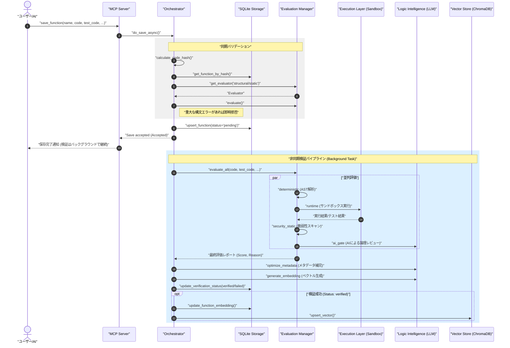
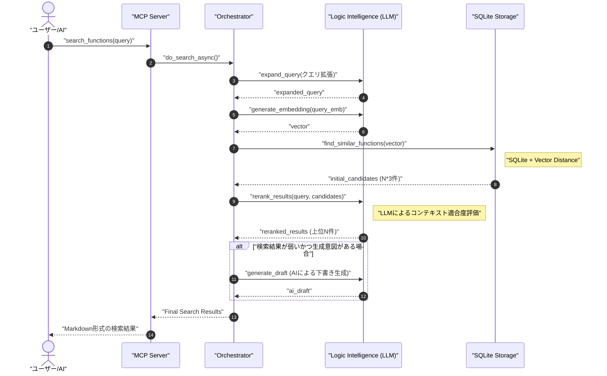

# LogicHive シーケンス図

本ドキュメントでは、LogicHive の主要なユースケースにおけるコンポーネント間の相互作用を定義します。

## 1. アセット保存とバックグラウンド検証 (do_save_async)

ユーザーが新しい関数を保存し、自動的に検証（品質ゲート）が実行される際の流れです。

## 2. ハイブリッド検索 (do_search_async)

自然言語クエリから、セマンティック検索と再ランキングを用いて最適な関数を見つける流れです。

