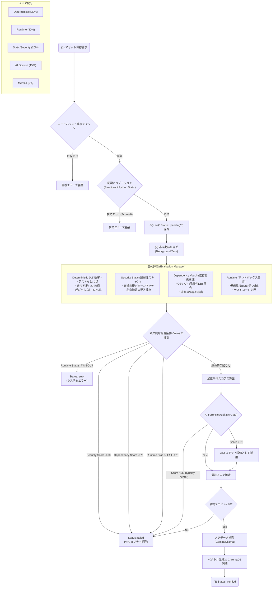
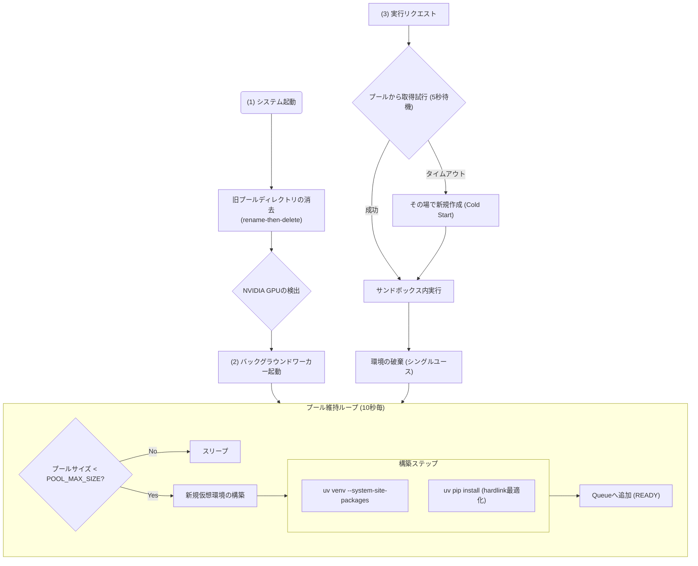
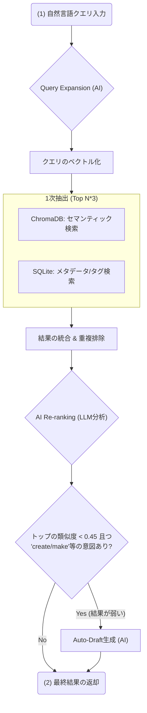

# LogicHive フローチャート図

本ドキュメントでは、LogicHive の主要な内部ロジックを詳細に定義します。高レベルな概要だけでなく、各判定ノードの具体的な閾値やエラーハンドリング、非同期処理のライフサイクルを含みます。

---

## 1. 品質ゲート (Quality Gate) 判定詳細フロー

アセット保存時にトリガーされる検証パイプラインの全容です。
単なる「成功/失敗」ではなく、重み付けによる最終スコアリングの仕組みを図解します。

---

## 2. インフラ：環境プール (Pool Manager) ライフサイクル

サンドボックス実行時の遅延（Cold Start）を最小化する、事前加温（Pre-warming）の仕組みです。

---

## 3. ハイブリッド検索 (Hybrid Search) 実行フロー

自然言語による曖昧な問い合わせから、高精度なアセットを抽出する多段階プロセスです。

